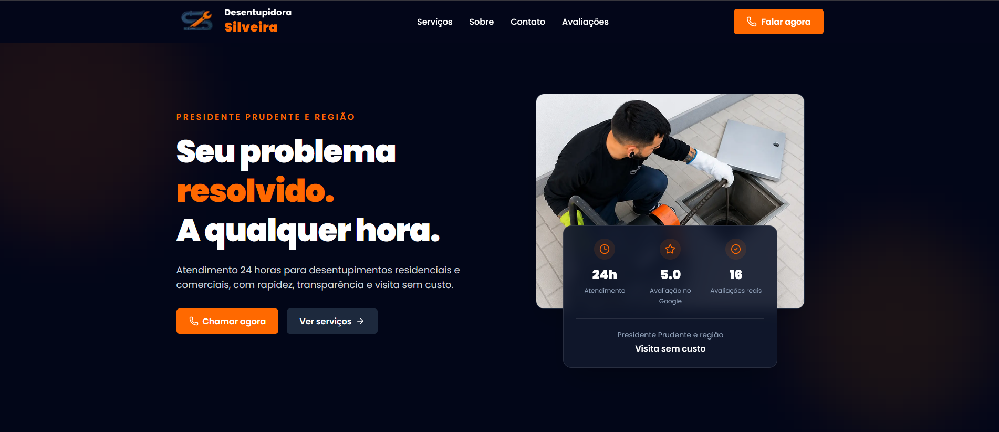
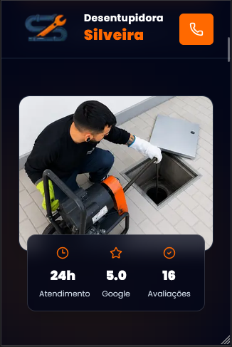

# Desentupidora Silveira Website

A production-ready business website built with Next.js, TypeScript and Tailwind CSS for a real drain cleaning company.

## The Problem

The company previously relied on a Wix website that lacked performance, flexibility and modern development practices.

## The Solution

A custom website focused on:

- Performance
- SEO
- Responsive design
- Accessibility
- High conversion
- Clean architecture

## 🛠 Tech Stack

| Technology | Purpose |
|------------|---------|
| Next.js 16 | React framework and static site generation |
| React | Component-based UI |
| TypeScript | Type safety |
| Tailwind CSS | Utility-first styling |
| Lucide React | Icons |
| next/image | Image optimization |
| Vercel | Deployment and hosting |
| Git & GitHub | Version control |

## Features

...

## Engineering Decisions

...

## 📸 Screenshots

| Desktop | Mobile |
|---------|--------|
|  |  |

### Services

### Testimonials

### Contact

## Local Setup

...

## Future Improvements

- Google Business Profile API integration
- ISR for daily review updates
- Analytics
- Floating WhatsApp CTA
